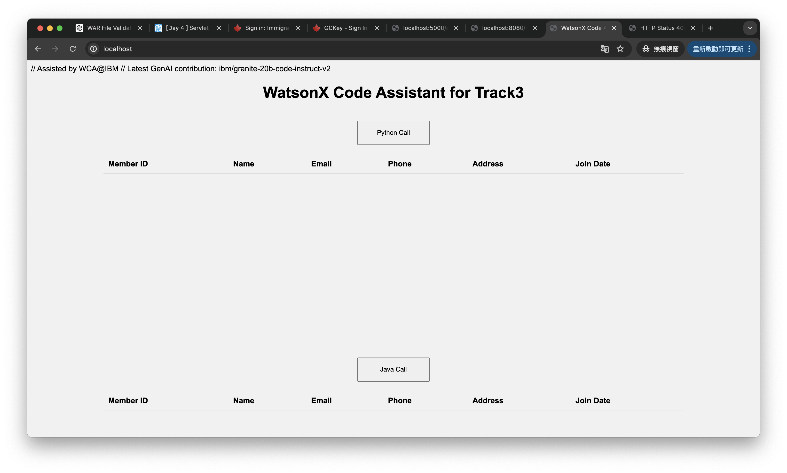
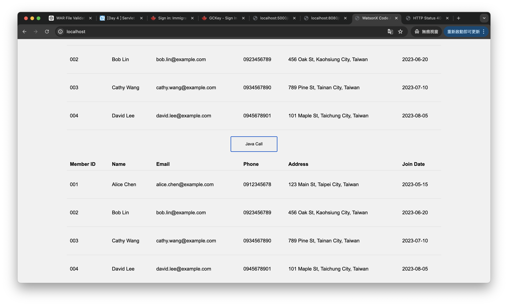
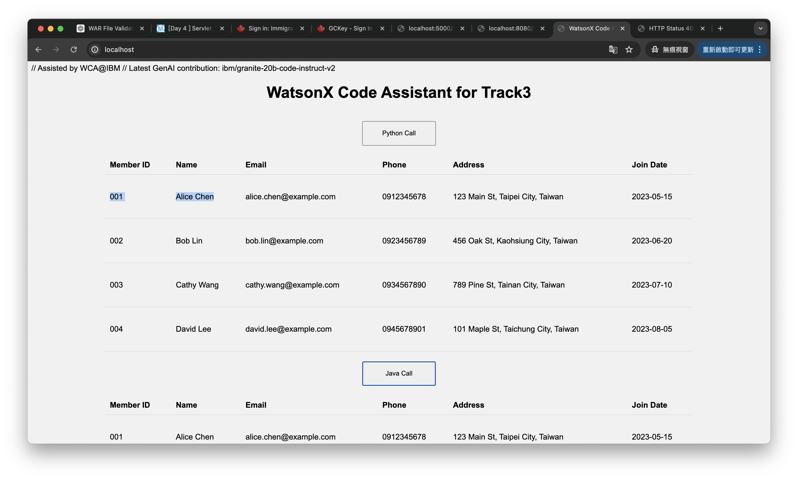
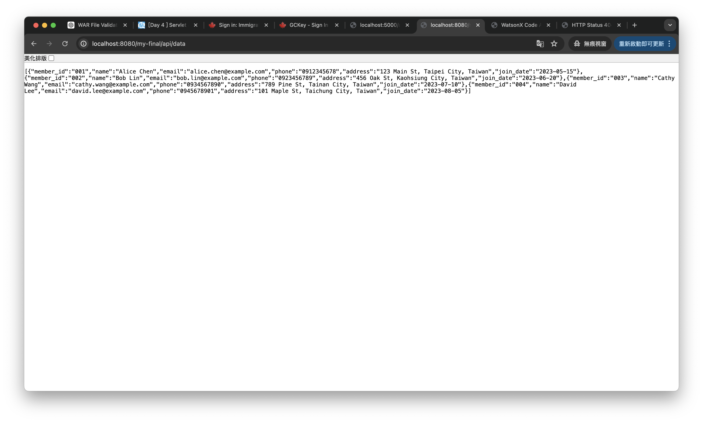
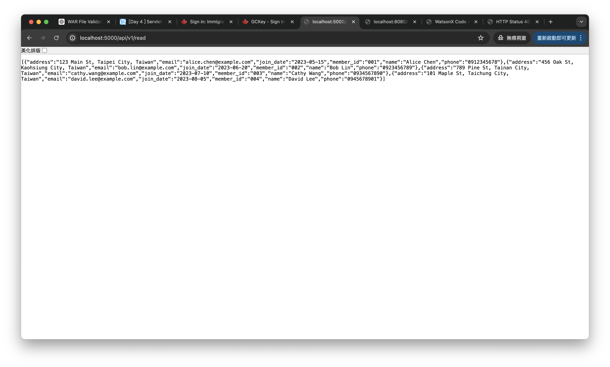

## 架構：
```
Container1 <Link> Container2/3
	Dockerfile
		HTML
		React.js
Container2 <Link> Container1
	Dockerfile
		Tomcat runtime
		RestAPI func by Java
		dataset.json
Container3 <Link> Container1
	Dockerfile
		FastAPI
		RestAPI func by Python
		dataset.json
```
  
## 成果：  



  
### 目的：
下prompt給WCA@IBM去生成程式碼，以下為prompting:

* * *


  
## Container11(Container1):

### Prompt1:
```
final/api/data
[{"member_id":"001","name":"Alice Chen","email":"alice.chen@example.com","phone":"0912345678","address":"123 Main St, Taipei City, Taiwan","join_date":"2023-05-15"},{"member_id":"002","name":"Bob Lin","email":"bob.lin@example.com","phone":"0923456789","address":"456 Oak St, Kaohsiung City, Taiwan","join_date":"2023-06-20"},{"member_id":"003","name":"Cathy Wang","email":"cathy.wang@example.com","phone":"0934567890","address":"789 Pine St, Tainan City, Taiwan","join_date":"2023-07-10"},{"member_id":"004","name":"David Lee","email":"david.lee@example.com","phone":"0945678901","address":"101 Maple St, Taichung City, Taiwan","join_date":"2023-08-05"}]
base on this java api, help me:
Generate a html file named index.html and css file named style.css and javascript file named act.js, that page title shows “watsonx code assistant for Track3”.
This page contains 2 buttons at the same margin, one is called “python call”, another is called “Java call”.
2 Tables are at the same margin and be under 2 buttons, 1 table named A is under the button of “python call” and another 1 table named B is under the button of “Java call”.
Table A and B are fixed height and width with scroll bars. html page should import jQuery library.
Button of “Python call” can call restful api and extract data from json file then show the data in the table A.
and button of “Java call” can call restful api and extract data from json file then show the data in the table B.
All api call functions should implement by jQuery ajax and can solve Cross-Origin Resource Sharing. Buttons and tales locates at the center of page.
After generate html , css and javascript filess, then generate a Dockerfile file.
Target is to contain index.html and css/style.css under css folder and js/act.js under js folder in Nginx Docker container and service port as 8080
Provide the time consumption of generating those files by each and shows quantity in second as unit
```

### Prompt2:
```
When I enter "call java" button, it will call api http://localhost:8080/my-final/api/data and get data
{"member_id":"001","name":"Alice Chen","email":"alice.chen@example.com","phone":"0912345678","address":"123 Main St, Taipei City, Taiwan","join_date":"2023-05-15"}, put the data in the table under the button.
```

### 產出:

Create a new resources directory in the src/main/java/com/example/myproject directory and add a new JSON file named data.json. This file will contain the data that we want to return as a JSON response.
Add the following JSON data to the data.json file.

Create a new **HTML file** named **index.html** in the **src/main/webapp** directory. This file will contain the HTML code for our web page.
Add the following HTML code to the index.html file:
```html
<!DOCTYPE html>
<html lang="en">
<head>
    <meta charset="UTF-8">
    <title>WatsonX Code Assistant for Track3</title>
    <link rel="stylesheet" href="css/style.css">
    <script src="https://ajax.googleapis.com/ajax/libs/jquery/3.6.3/jquery.min.js"></script>
    <script src="js/act.js"></script>
</head>
<body>
<div id="container">
    <button id="btn-py">Python Call</button>
    <button id="btn-java">Java Call</button>
    <table id="table-a" class="table">
        <thead>
        <tr>
            <th>Member ID</th>
            <th>Name</th>
            <th>Email</th>
            <th>Phone</th>
            <th>Address</th>
            <th>Join Date</th>
        </tr>
        </thead>
        <tbody></tbody>
    </table>
    <table id="table-b" class="table">
        <thead>
        <tr>
            <th>Member ID</th>
            <th>Name</th>
            <th>Email</th>
            <th>Phone</th>
            <th>Address</th>
            <th>Join Date</th>
        </tr>
        </thead>
        <tbody></tbody>
    </table>
</div>
</body>
</html>
```

Create a new **CSS file** named **style.css** in the **src/main/webapp/css** directory. This file will contain the CSS styles for our web page.
Add the following CSS code to the style.css file:

```css
#container {
    display: flex;
    justify-content: center;
    align-items: center;
    flex-direction: column;
}

.table {
    border-collapse: collapse;
    width: 80%;
    height: 200px;
    overflow-y: auto;
}

.table th, .table td {
    border: 1px solid black;
    padding: 5px;
}

#btn-py, #btn-java {
    margin: 20px;
}
```

Create a new **JavaScript file** named **act.js** in the **src/main/webapp/js** directory. This file will contain the JavaScript code for our web page.
Add the following JavaScript code to the act.js file:

```js
$(document).ready(function () {
    $('#btn-py').click(function () {
        $.ajax({
            url: 'http://localhost:8080/my-final/api/data',
            dataType: 'json',
            success: function (data) {
                var table = $('#table-a tbody');
                table.empty();
                $.each(data, function (index, item) {
                    $('<tr>')
                            .append($('<td>').text(item.member_id))
                            .append($('<td>').text(item.name))
                            .append($('<td>').text(item.email))
                            .append($('<td>').text(item.phone))
                            .append($('<td>').text(item.address))
                            .append($('<td>').text(item.join_date))
                            .appendTo(table);
                });
            }
        });
    });

    $('#btn-java').click(function () {
        $.ajax({
            url: 'http://localhost:8080/my-final/api/data',
            dataType: 'json',
            success: function (data) {
                var table = $('#table-b tbody');
                table.empty();
                $.each(data, function (index, item) {
                    $('<tr>')
                            .append($('<td>').text(item.member_id))
                            .append($('<td>').text(item.name))
                            .append($('<td>').text(item.email))
                            .append($('<td>').text(item.phone))
                            .append($('<td>').text(item.address))
                            .append($('<td>').text(item.join_date))
                            .appendTo(table);
                });
            }
        });
    });
});
```

Create a new **Dockerfile** file in the root directory of your project. This file will contain the instructions for building our Docker image.
Add the following Dockerfile code to the Dockerfile file:

```Dockerfile
FROM nginx:latest
COPY ./target/my-final-1.0-SNAPSHOT.war /usr/share/nginx/html/my-final.war
COPY ./src/main/webapp/index.html /usr/share/nginx/html/index.html
COPY ./src/main/webapp/css/style.css /usr/share/nginx/html/css/style.css
COPY ./src/main/webapp/js/act.js /usr/share/nginx/html/js/act.js
EXPOSE 8080
CMD ["nginx", "-g", "daemon off;"]
```

**Build** your Docker image by running the following command in the terminal:
```linux
docker build -t my-final:latest .
```

**Run** your Docker container by executing the following command in the terminal:
```
docker run -p 8080:8080 my-final:latest
```

Access your web page at **http://localhost:8080/index.html**. You should see a page with two buttons and two tables. Clicking the "Python Call" button should populate the first table with data from the data.json file, while clicking the "Java Call" button should populate the second table with the same data.
Note: Make sure you have Docker installed on your system before running these commands.

Time Consuming: 175 minutes

執行過程：
```
cd Container11
docker images
docker rmi 4e6148d6840d  #刪掉剛剛失敗的
docker build -t watsonx/track3-code-assistant:latest .
docker run -d -p 80:80 watsonx/track3-code-assistant:latest
```

**file structure:**
```
.
├── Dockerfile
├── css
│   └── style.css
├── index.html
└── js
    └── act.js
```
* * *

  
## my-final(Container2):

### Prompt1:

```
I have zero experience in Java. Please tell me the most detail step:
Create a java web application that has one function that can read json file as api call with Get method.
After that, use Maven to build war file then deploy to Docker container using tomcat image. Set sevice port 8080
```

### 產出:
Sure, here's a detailed step-by-step guide on how to create a Java web application that reads a JSON file as an API call with GET method, builds a WAR file using Maven, deploys it to a Docker container using the Tomcat image, and sets the service port to 8080:

1. Install Java Development Kit (JDK) 11 or higher: You need JDK 11 or higher to compile and run your Java code. If you don't have JDK installed, you can download it from the official Oracle website.

2. Install Apache Maven: Apache Maven is a build automation tool used to manage Java projects. It helps to compile, test, package, and deploy Java applications. You can download and install Maven from the official website.

3. Create a new Maven project: Run the following command in your terminal to **create a new Maven project**:
```
mvn archetype:generate -DgroupId=com.example -DartifactId=my-app -DarchetypeArtifactId=maven-archetype-webapp
```
4. Navigate to the project directory: Change your current working directory to the project directory:
```
cd my-app
```
5. Add the Jackson library dependency: Open the **pom.xml file** in your favorite text editor and add the Jackson library dependency under the <dependencies> tag:
```xml
<dependency>
 <groupId>com.fasterxml.jackson.core</groupId>
 <artifactId>jackson-databind</artifactId>
 <version>2.13.0</version>
</dependency>
```
6. Create the **JSON file**: Create a new JSON file called data.json in the **src/main/resources** folder with the following content:
```JSON
{
 "message": "Hello, world!"
}
```
7. Create the **Java class**: Create a new Java class called **MyApp.java** in the **src/main/java/com/example** folder with the following content:
```java
package com.example;
import java.io.IOException;
import java.nio.file.Files;
import java.nio.file.Paths;
import jakarta.servlet.ServletException;
import jakarta.servlet.annotation.WebServlet;
import jakarta.servlet.http.HttpServlet;
import jakarta.servlet.http.HttpServletRequest;
import jakarta.servlet.http.HttpServletResponse;
import com.fasterxml.jackson.databind.ObjectMapper;

@WebServlet("/api/data")
public class MyApp extends HttpServlet {
   private static final long serialVersionUID = 1L;

   @Override
   protected void doGet(HttpServletRequest request, HttpServletResponse response)
           throws ServletException, IOException {
       String json = new String(Files.readAllBytes(Paths.get("src/main/resources/data.json")));
       ObjectMapper mapper = new ObjectMapper();
       Object obj = mapper.readValue(json, Object.class);
       response.setContentType("application/json");
       response.getWriter().write(mapper.writeValueAsString(obj));
   }
}
```
8. Build the **WAR file**: Run the following command to build the WAR file:
```
mvn package
```
9. Install Docker: Download and install Docker from the official website.

10. Pull the Tomcat image: Pull the latest Tomcat image from Docker Hub using the following command:
```
docker pull tomcat:latest
```
11. Start the Tomcat container: **Start a new Tomcat container** using the following command:
```
docker run -d -p 8080:8080 --name my-tomcat -v "$(pwd)"/target/my-app.war:/usr/local/tomcat/webapps/my-app.war tomcat:latest
```
12. Test the application: Open your web browser and navigate to **http://localhost:8080/my-app/api/data**. You should see the following output:
```
{"message":"Hello, world!"}
// 後續改成自己想要的data.json
```
13. Set the service port: By default, the Tomcat container uses port 8080 for HTTP traffic. However, you may want to set a different port for your application. To do this, you can modify the docker run command to map the desired port to port 8080 inside the container:
```
docker run -d -p <desired_port>:8080 --name my-tomcat -v "$(pwd)"/target/my-app.war:/usr/local/tomcat/webapps/my-app.war tomcat:latest
```
In this case, replace <desired_port> with the desired port number. For example, if you want to use port 80 instead, you can run the following command:
```
docker run -d -p 80:8080 --name my-tomcat -v "$(pwd)"/target/my-app.war:/usr/local/tomcat/webapps/my-app.war tomcat:latest
```
That's it! You've created a Java web application that reads a JSON file as an API call with GET method, built a WAR file using Maven, deployed it to a Docker container using the Tomcat image, and set the service port to 8080.

### Prompt2:
```
Tell me the detailed file structure:
```
### 產出:
```
my-app/
├── pom.xml
└── src/
    ├── main/
        ├── java/
        │   └── com/
        │       └── example/
        │           └── MyApp.java
        └── resources/
            └── data.json
    └── test/
        └── java/
```


### 後續修改:

新增or更改部分：
```java
import java.io.InputStream;
import java.nio.charset.StandardCharsets;

    @Override
    protected void doGet(HttpServletRequest request, HttpServletResponse response)
            throws ServletException, IOException {
        InputStream inputStream = getServletContext().getResourceAsStream("/WEB-INF/classes/data.json");
        if (inputStream == null) {
            response.sendError(HttpServletResponse.SC_NOT_FOUND, "Resource not found");
            return;
        }
        String json = new String(inputStream.readAllBytes(), StandardCharsets.UTF_8);
        ObjectMapper mapper = new ObjectMapper();
        Object obj = mapper.readValue(json, Object.class);

        response.setHeader("Access-Control-Allow-Origin", "*");
        response.setHeader("Access-Control-Allow-Methods", "GET, POST, OPTIONS");
        response.setHeader("Access-Control-Allow-Headers", "Content-Type");
        response.setContentType("application/json");
        response.getWriter().write(mapper.writeValueAsString(obj));
    }
}
```

增加**Dockerfile**:
```Dockerfile
FROM tomcat:10.1-jdk11-openjdk-slim
COPY target/my-final.war /usr/local/tomcat/webapps/
EXPOSE 8080
```


### 執行：
```
mvn clean package
docker build -t my-final .
docker run -p 8080:8080 my-final
```

**file structure:**
```
.
├── Dockerfile
├── pom.xml
├── src
│   └── main
│       ├── java
│       │   └── com
│       │       └── example
│       │           └── MyApp.java
│       ├── resources
│       │   └── data.json
│       └── webapp
│           ├── WEB-INF
│           │   └── web.xml
└──           └── index.jsp
```
\n


  

* * * 
## Container3:

### Prompt:

```
Create app.py can run web server service and have one function that can read json file as api call with get method.
This function also can solve CORS issue. Also giva me the requirements.txt content.
After that, deploy to Docker containe and show the file structure.
```

### 產出:
Sure! Here's what I found:

**Python app.py** file:
```python
import json
from flask import Flask, request
app = Flask(__name__)

@app.route('/api/v1/read', methods=['GET'])
def read_json():
    with open('data.json') as f:
        data = json.load(f)
    return data

if __name__ == '__main__':
    app.run()
```

Here's the **requirements.txt** file:
```
flask==2.0.3
json==2.0.9
```

To deploy this application to Docker container, you can follow these steps:
Create a **Dockerfile** with the following contents:
```Dockerfile
FROM python:3.8-slim
WORKDIR /app
COPY requirements.txt ./
RUN pip install --no-cache-dir -r requirements.txt
COPY . .
CMD [ "python", "./app.py" ]
```

**Build** the Docker image:
```
docker build -t container3:latest .
```

**Run** the Docker container3:
```
docker run -p 5000:5000 container3
```

**Test** the application by making an API call:
```
curl http://localhost:5000/api/v1/read
```
This should return the contents of the data.json file.

Here's the **file structure** of your project:
```
.
├── Dockerfile
├── README.md
├── app.py
├── data.json
└── requirements.txt
```

### 後來修改：

**Requirements.txt** file:
```
Flask==2.0.3
requests==2.27.1
simplejson==3.17.6
Werkzeug==2.0.3
```

**Python app.py** file:
```python
return jsonify(data)  # Convert dictionary to JSON response
```

**file structure:**
```
.
├── Dockerfile
├── css
│   └── style.css
├── index.html
└── js
    └── act.js
```




